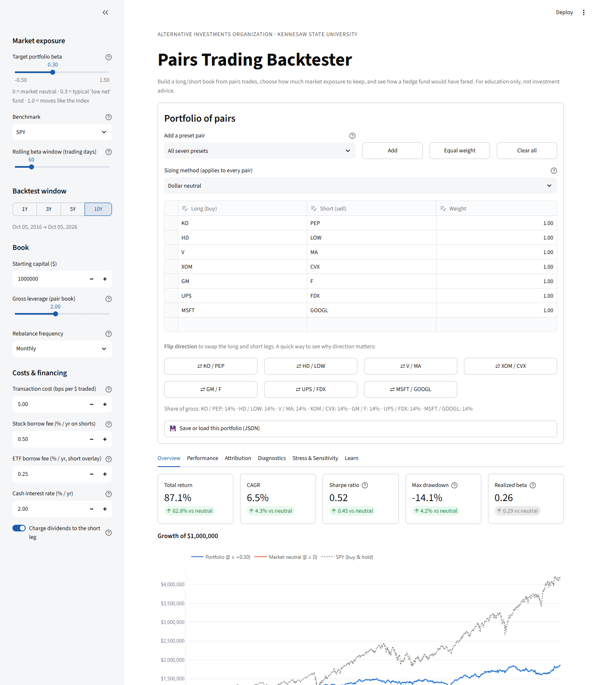
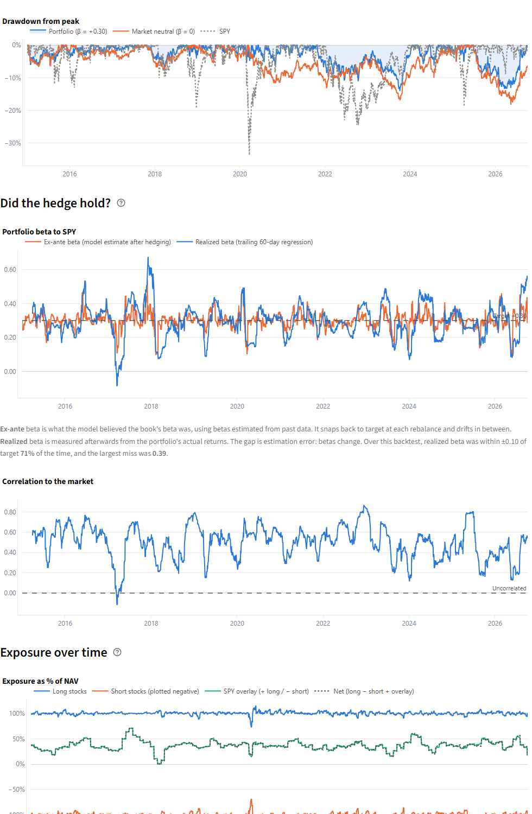
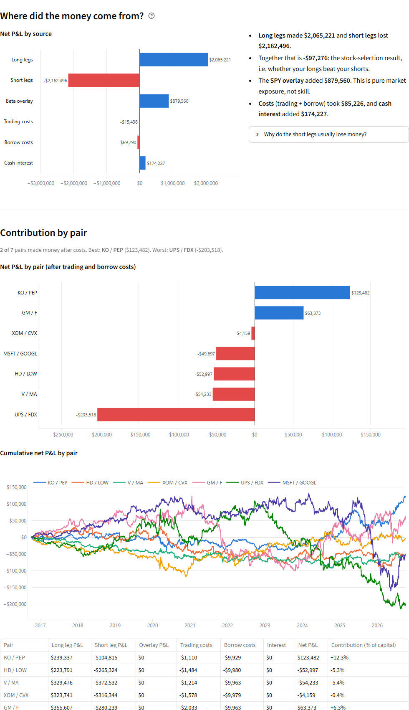
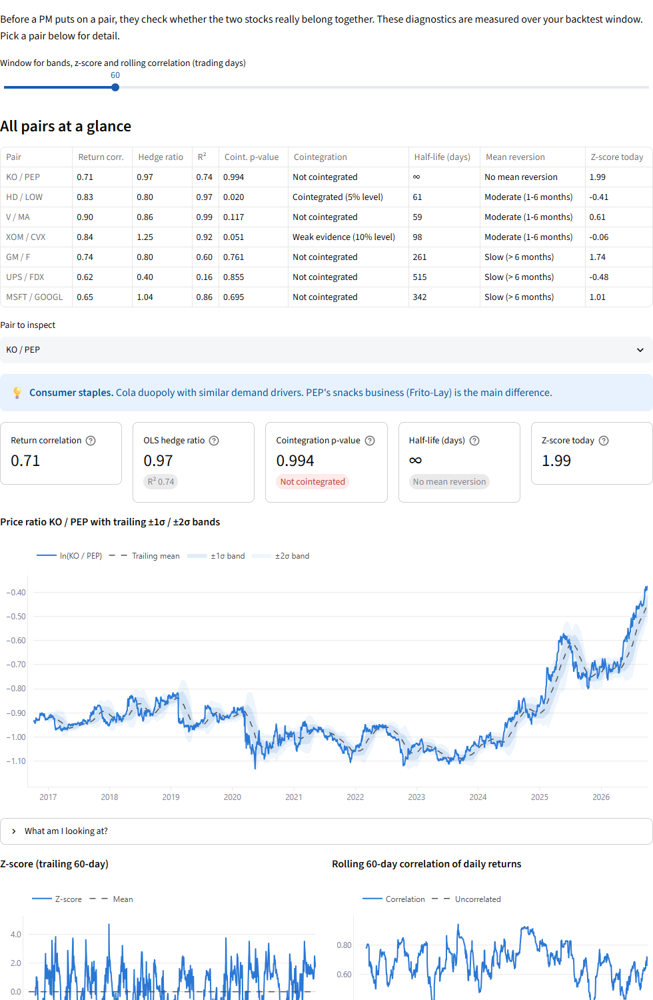
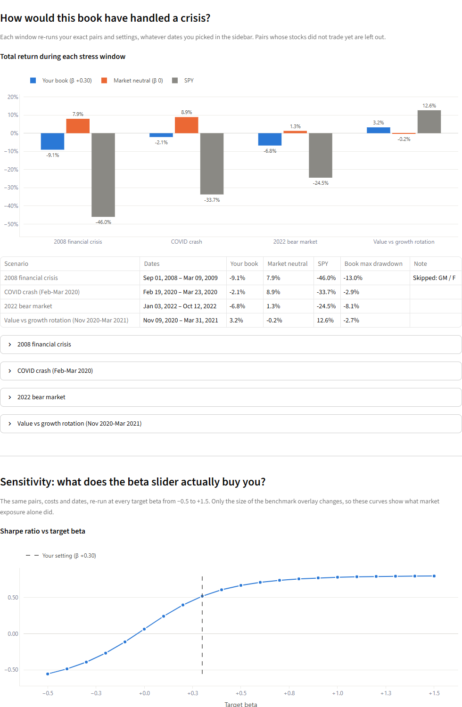

# HF Pairs: Educational Pairs Trading Backtester

[](https://hfpairs-presleyc.streamlit.app/)

**Live app: [hfpairs-presleyc.streamlit.app](https://hfpairs-presleyc.streamlit.app/)**. Runs in the browser, nothing to install.

Built for the **Alternative Investments Organization at Kennesaw State University**.

Enter a list of pairs trades (for example, long KO and short PEP) and the app backtests them as one long/short equity portfolio. A **target beta slider** sets how much market exposure the book keeps, because most real hedge funds are not perfectly market neutral. Every concept has an explanation next to it, so students learn how a long/short fund builds, hedges and stress-tests a pairs book while they use the tool.



## Run it locally

```bash
git clone https://github.com/PresleyCooper/HF_Pairs.git
cd HF_Pairs
python -m venv .venv
.venv\Scripts\activate          # Windows
# source .venv/bin/activate     # macOS / Linux
pip install -r requirements.txt
streamlit run app.py
```

Your browser opens at http://localhost:8501. Pick **All seven presets → Add** to load the example pairs, then move the **Target portfolio beta** slider.

The first run downloads full price history for each ticker from Yahoo Finance and caches it in `.cache/prices/` for the rest of the day. After that, switching lookbacks and settings is instant.

## What it does

| Tab | What students see |
| --- | --- |
| **Overview** | Headline numbers, equity curve against a market-neutral version and the benchmark, and a full stats table (total return, CAGR, volatility, Sharpe, Sortino, max drawdown, Calmar, realized beta, alpha, correlation, hit rate, average win vs loss) side by side for the chosen beta and for β = 0. Also a CSV download of daily results. |
| **Performance** | Drawdowns, target vs ex-ante vs realized beta ("did the hedge hold?"), rolling correlation to the market, long/short/overlay exposure over time, and each pair's equity curve on its own. |
| **Attribution** | P&L by source (long legs, short legs, overlay, costs, cash interest) and by pair. **What went wrong** dissects the worst drawdown and names the pair that hurt most. |
| **Diagnostics** | Per pair: price ratio with z-score bands, rolling correlation, OLS hedge ratio, Engle-Granger cointegration p-value and half-life of mean reversion, each with a plain-English "why a PM cares". |
| **Stress & Sensitivity** | The same book run through the 2008 crisis, the March 2020 crash, the 2022 bear market and the Nov 2020 value rotation, plus Sharpe, CAGR and drawdown across target betas from −0.5 to +1.5. |
| **Learn** | How pairs trading works, why funds run it, how it fails, the main backtest pitfalls, a glossary, and suggested exercises. |

**Pair input.** Editable table with a long ticker, short ticker and weight, plus one sizing method for the whole book (dollar neutral, beta neutral or volatility matched). It includes preset pairs (KO/PEP, HD/LOW, V/MA, XOM/CVX, GM/F, UPS/FDX, MSFT/GOOGL), one-click **flip direction** buttons, and **save/load as JSON** (pairs plus every sidebar setting).

**Assumptions** (sidebar, each with a tooltip):
- target beta, benchmark (SPY/QQQ/IWM/DIA) and beta window
- backtest window (1, 3, 5 or 10 years ending today), capital and gross leverage
- rebalance frequency (daily/weekly/monthly/never)
- transaction costs, stock and ETF borrow fees, and cash rate
- whether short positions pay dividends

| | |
| --- | --- |
|  |  |
|  |  |

## How the engine works

The engine (`pairs_engine/`) is plain Python with no UI code, so it can be tested and reused on its own:

```python
from datetime import date
from pairs_engine import BacktestConfig, PairSpec, load_prices, run_backtest, warmup_start
from pairs_engine.analytics import result_stats

pairs = [PairSpec("KO", "PEP"), PairSpec("HD", "LOW", sizing="beta_neutral")]
cfg = BacktestConfig(start=date(2015, 1, 1), end=date(2024, 12, 31), target_beta=0.3)
tickers = sorted({t for p in pairs for t in (p.long, p.short)})
data = load_prices(tickers, warmup_start(cfg.start, cfg.beta_window), cfg.end, cfg.benchmark).data
print(result_stats(run_backtest(pairs, cfg, data)))
```

- **Timing (no lookahead).** At each close, positions first earn that day's return. Then, on rebalance days, new targets are set using betas and volatilities estimated *only* from returns up to that close. `tests/test_no_lookahead.py` checks this by corrupting all future prices and confirming that nothing earlier changes.
- **Sizing.** Each pair gets `gross leverage × NAV × weight` in gross dollars. Dollar neutral splits it evenly. Beta neutral solves `long × β_long = short × β_short`, and vol matched solves `long × σ_long = short × σ_short`, both keeping the pair's gross fixed. Estimates below 0.1 are floored so a near-zero beta can't create a huge leg.
- **Beta overlay.** A benchmark ETF position of `(target β − book β) × NAV`. It sits *outside* the gross leverage budget, the way a PM sizes the book and then hedges it.
- **Holdings drift.** Positions are held like shares between rebalances. "Never" rebalance means buy on day one and let everything, including the hedge, drift.
- **Costs.** Transaction costs in bps on every dollar traded (trades aren't netted across pairs). Borrow fees are charged on short notional, with a separate lower rate when the overlay is short the ETF. Interest is earned on cash plus short proceeds (paid at the same rate if leverage makes cash negative). Accruals use actual/365.
- **Dividends.** Prices come from Yahoo's split-adjusted `Close` and total-return `Adj Close`. Longs earn total return. Shorts pay total return (i.e. pay the dividend) unless that switch is off.
- **Attribution** reconciles exactly. Per-pair P&L plus overlay plus cash interest equals the change in NAV, and this is tested.

## Known limitations

These are covered in the app's Learn tab:
- **Survivorship bias.** Yahoo Finance has no data for delisted companies.
- **Borrow is always available** at a flat fee. There are no recalls, squeezes or hard-to-borrow spikes.
- **One cash rate** for lending and borrowing, set by the user rather than taken from historical T-bill rates.
- Diagnostics' hedge ratio, cointegration test and half-life are **full-sample** (in-sample) statistics. The backtest never uses them.
- Pairs are **always held**: this is a static long/short book, not a z-score entry/exit strategy.

## Project layout

| Path | What it is |
| --- | --- |
| `app.py` | Streamlit entry point (wiring only) |
| `pairs_engine/config.py` | `PairSpec` (one pair) and `BacktestConfig` (all assumptions) |
| `pairs_engine/data.py` | yfinance loader, calendar alignment, short-history warnings |
| `pairs_engine/price_cache.py` | Daily on-disk parquet cache of full price histories |
| `pairs_engine/beta.py` | Rolling, point-in-time beta, volatility and correlation |
| `pairs_engine/sizing.py` | Dollar-neutral, beta-neutral and volatility-matched leg sizing |
| `pairs_engine/costs.py` | Transaction cost, borrow fee, cash interest |
| `pairs_engine/backtest.py` | Daily simulation loop with the beta overlay |
| `pairs_engine/analytics.py` | Tear-sheet stats, drawdowns, attribution, daily report |
| `pairs_engine/diagnostics.py` | Z-score bands, hedge ratio, cointegration, half-life |
| `pairs_engine/scenarios.py` | Historical stress windows |
| `pairs_engine/sensitivity.py` | Sweep of target beta vs Sharpe / CAGR / drawdown |
| `pairs_engine/portfolio_io.py` | JSON save/load |
| `pairs_engine/presets.py` | Example pairs with a one-line rationale each |
| `ui/` | Sidebar, pair editor, chart builders, glossary text, and one module per tab in `ui/tabs/` |
| `tests/` | pytest suite (runs offline on synthetic data) |

## Tests

```bash
pytest -q
```

48 tests cover:
- leg sizing and the beta floor
- the overlay hitting each target beta (−0.5, 0, 1, 1.5) and sitting outside gross
- transaction, borrow, interest and short-dividend costs
- no lookahead
- stats on known series and attribution reconciling to NAV
- diagnostics on synthetic cointegrated and independent series
- the data loader
- scenarios, the beta sweep and JSON round-tripping

---

*For education only. Not investment advice.*
